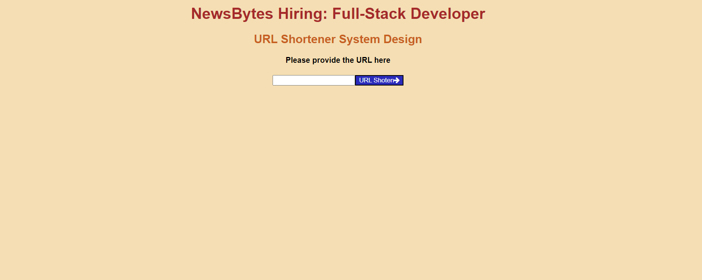
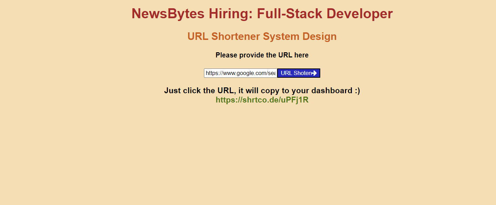

To run this application

npm run

Demo

Screenshots 

Provide the URL that you want to shorten

After clicking the URL Shorten button provides the shortened URL

when you click on the shortened URL its copied to your clipboard

